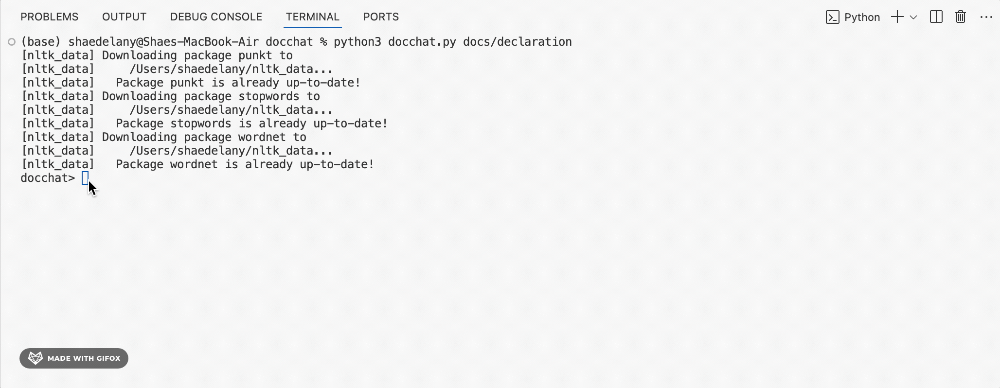

# DocChat: Conversational Interface to chat with Documents!

DocChat is a Python-based conversational assistant that is designed to analyze, summarize, and extract insights from documents using large language models. It has the capability to do this with pdf files, basic text files, and even html files. 


## Features
- Extracts and summarizes content
- Interfaces with LLMs (via `groq` or compatible API)
- Cleans and lemmatizes text with `nltk`
- Uses `BeautifulSoup` for web parsing 

## Files
- `docchat.py`: Main interface and document interaction logic
- `docsum.py`: Text summarization and NLP logic

## Installation and Example Usage
There is a file in this repository named **requirements.txt**. This has all the required installments that are needed in order for this program to run. Run this in your terminal:
```$ pip3 install -r requirements.txt```

Once everything is installed you can run the program to chat with DocChat! Here's an example of how my program answers the question well. 

```
$ python3 docchat.py docs/declaration
docchat> what is this document?
Based on the provided summary, this document is the Declaration of Independence, adopted by the Continental Congress on July 4, 1776.
docchat> what is it about?
The document is about the Declaration of Independence, which states that the 13 American colonies are free and independent states, and lists the grievances against King George III of Great Britain, concluding that it is the duty of the people to establish a new government when the existing one is destructive of their rights and liberties.
docchat>
```

You want to watch for how your program responds to the given prompt in your code. For instance, this shows a bad example where the program answers the questions poorly. 

```
$ python3 docchat.py docs/declaration
docchat> what is this document?
Declaration o' Indy
docchat> what is it about?
Doing some revolution-stuff!
docchat>
```

You can help this by going to the *messages* accumulator and editing the 'content' on line 211 of the **docchat.py** program file in the repository.

## GIF Demo!

